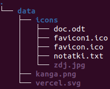

# file struct


 
## **URL** /api/data 
**/api/data** prowadzi do katalogu fizycznego **/public/data**

# ERROR STRUCTURE 
```ts
Error = type {
    code:string
    message:string
}
```

# DOSTĘP DO KATALOGU

Wywołanie GET /api/data 
Response Status = 400 Bad Request
Zwrocony zostanie obiekt typu Error 
```json
    Request body = { 
        "code": 1,
        "message":"Requested path directs to directory. Use ?list=true to list directory."
    }
```
Umieszczajac powyższe query w odpowiedzi dostaniemy:

```ts
DiscObject = {
    type: "DIR" | "FILE"
    name: string
} 

ResponseBodyStructure = {
    path: string
    items: DiscObject[]
}
```
# DOSTĘP DO PLIKU

* URL: /api/data/kanga
* URL: /api/data/kanga.*

Prowadzą to tego samego pliku **kanga.png**.
Ignorowanie rozszerzenia upraszcza korzystanie z serwisu.
 
Response = 200 OK + żądany zasób

# WPROWADZENIE ZŁEJ ŚCIEŻKI
Zapytanie które odnosi się do **NIE** istniejącej ściezki skutuje odpowiedzą. 204 No Content 

```json
    Request Body = { 
        "code": 2,
        "message":"Requested path does not exist."
    }
```


